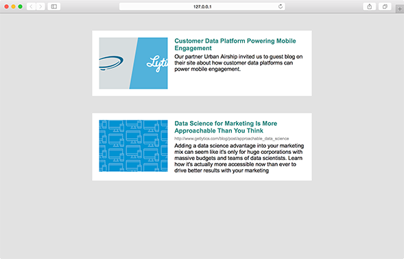

Pathfora also supports "fill in the blank" style inline content recommendations. That is, you can set up your html elements to match the look and feel of your website, and add attributes which will signal to pathfora to fill in the content with results from the Lytics content recommendation API.

``` html
<div data-pfblock="my-recommendation" data-pfrecommend="www.example.com/blog/*">
  <div data-pftype="image"></div>
  <a data-pftype="url"><h2 data-pftype="title"></h2></a>
  <p data-pftype="description"></p>
</div>
```


## Attributes

Each toggleable content recomendation block should have a surrounding container element with the following elements.

<table>
  <thead>
    <tr>
      <td colspan="3" align="center">HTML data <code>attribute</code></td>
    </tr>
    <tr>
      <th>Attribute</th>
      <th>Value Type</th>
      <th>Value</th>
    </tr>
  </thead>
  
  <tr>
    <td>data-pfblock</td>
    <td>string</td>
    <td>a unique string name for a single recommendation block</td>
  </tr>
  <tr>

  <tr>
    <td>data-pfrecommend</td>
    <td>string</td>
    <td>url pattern to filter results from the recommendation API</td>
  </tr>
</table>

The `pfrecommend` attribute value may contain wildcards in the url, and should not include the http protocol in the url. This value gets used to formulate the filter we pass to the recommendation API. If you do not want to set a filter this value should be `*`.

Inside the container element you may have several elements with the `data-pftype` attribute. Based on the value of this attribute, Pathfora will set the innerHTML or an attribute of this element to contain a content recommendation for the user.

<table>
  <thead>
    <tr>
      <td colspan="2" align="center">value of <code>data-pftype</code> attribute</td>
    </tr>
    <tr>
      <th>Value</th>
      <th>Behavior</th>
    </tr>
  </thead>
  
  <tr>
    <td>image</td>
    <td>on an <code>img</code> tag this will set the <code>src</code> value to be the meta image of the document, otherwise it will set the <code>background-image</code></td>
  </tr>

  <tr>
    <td>url</td>
    <td>on an <code>a</code> tag this will set the <code>href</code> value to be the url of the document, otherwise it will set the innerHTML to be this url</td>
  </tr>

  <tr>
    <td>title</td>
    <td>set the innerHTML of this element to be the title of the document</td>
  </tr>

  <tr>
    <td>description</td>
    <td>set the innerHTML of this element to be the meta description of the document</td>
  </tr>
</table>

If for some reason the recommendation API returns an error for the user, and cannot fill in recommendation, you can set some default content to show by creating another set of elements with content you've selected filled in and the `data-pfrecommend` value set to default. This content will only show if the any recommendation with a matching `data-pfblock` couldn't be loaded.

<h3>Content Recommendations - <a href="../examples/preview/inline/content.html" target="_blank">Live Preview</a></h3>



<pre data-src="../examples/src/inline/content.html"></pre>
