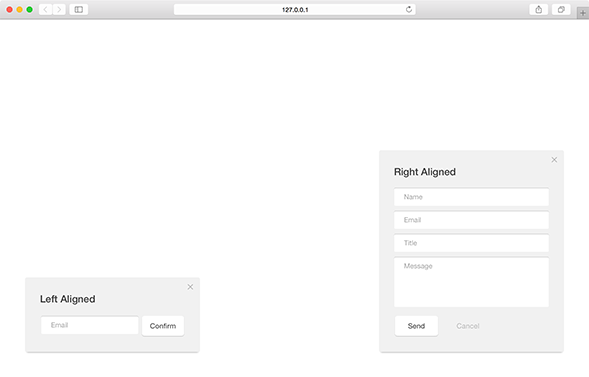
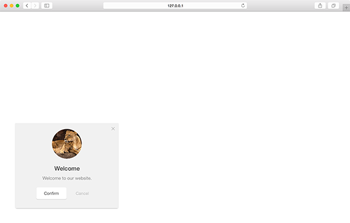

A slideout is a medium module which slides from either side into the window. This module provides a good amount of space for text and content without taking the full attention of the user.

## position

Positition of the slideout module relative to the browser window.

<table>
  <thead>
    <tr>
      <td colspan="2" align="center"><code>position</code> string</td>
    </tr>
    <tr>
      <th>Value</th>
      <th>Behavior</th>
    </tr>
  </thead>
  
  <tr>
    <td>bottom-left</td>
    <td><code>default</code> display the module in the bottom left corner of the window</td>
  </tr>
  <tr>
    <td>bottom-right</td>
    <td>display the module in the bottom right corner of the window</td>
  </tr>
</table>

<h3>Positions - <a href="../../examples/preview/layouts/slideout/positions.html" target="_blank">Live Preview</a></h3>

<pre data-src="../../examples/src/layouts/slideout/positions.js"></pre>

## origin

Origin is the direction from which the the module will slide in.

<table>
  <thead>
    <tr>
      <td colspan="2" align="center"><code>origin</code> string</td>
    </tr>
    <tr>
      <th>Value</th>
      <th>Behavior</th>
    </tr>
  </thead>
  
  <tr>
    <td>left</td>
    <td><code>default</code> for bottom-left positioned modules</td>
  </tr>
  <tr>
    <td>right</td>
    <td><code>default</code> for bottom-right positioned modules</td>
  </tr>
  <tr>
    <td>bottom</td>
    <td>module slides up from the bottom of the window</td>
  </tr>
</table>

<h3>Bottom - <a href="../../examples/preview/layouts/slideout/origin.html" target="_blank">Live Preview</a></h3>

<pre data-src="../../examples/src/layouts/slideout/origin.js"></pre>

## variant

Variant determines any extra content that may be used by the module.

<table>
  <thead>
    <tr>
      <td colspan="2" align="center"><code>variant</code> int</td>
    </tr>
    <tr>
      <th>Value</th>
      <th>Behavior</th>
    </tr>
  </thead>
  
  <tr>
    <td>1</td>
    <td><code>default</code> text-only-module</td>
  </tr>
  <tr>
    <td>2</td>
    <td>module includes an image</td>
  </tr>
  <tr>
    <td>3</td>
    <td>module includes a content recommendation</td>
  </tr>
</table>

## image

Define the featured image you would like to use for the module.

**Note:** This setting is only valid for modules with a variant value of 2.

<table>
  <thead>
    <tr>
      <th>Key</th>
      <th>Type</th>
      <th>Behavior</th>
    </tr>
  </thead>
  
  <tr>
    <td>image</td>
    <td>string</td>
    <td>URL of the image to feature</td>
  </tr>
</table>

<h3>Image (variant 2) - <a href="../../examples/preview/layouts/slideout/image.html" target="_blank">Live Preview</a></h3>

<pre data-src="../../examples/src/layouts/slideout/image.js"></pre>

## recommend

Recommend controls any parameters necessary for making a content suggestions to a user using the Lytics content recommendation API. Your Lytics account ID must be present in the call to [initializeWidgets](/api/methods.md#initializewidgets) for content recommendation modules.

**Note:** This setting is only valid for [message modules](/types/message.md) with a variant value of 3.

<table>
  <thead>
    <tr>
      <td colspan="3" align="center"><code>recommend</code> object</td>
    </tr>
    <tr>
      <th>Key</th>
      <th>Type</th>
      <th>Behavior</th>
    </tr>
  </thead>
  
  <tr>
    <td>ql</td>
    <td>string</td>
    <td>formatted query to filter based on url, topic or other content variables*</td>
  </tr>
</table>

*Currently Pathfora supports a **beta** version of content recommendation, that is, suggesting content on a user-level based on their content affinity. If you would like to try out this feature _please_ contact your customer success representative `success@lytics.io` to help set this up.

## content

Content acts as a backfill/helper for the [recommend key](#recommend). If the content recommendation API cannot return a recommendation for the user (if they don't have any content affinity data or an error occurs), a default document may be provided.

<table>
  <thead>
    <tr>
      <td colspan="3" align="center">object in <code>content</code> array</td>
    </tr>
    <tr>
      <th>Key</th>
      <th>Type</th>
      <th>Behavior</th>
    </tr>
  </thead>
  
  <tr>
    <td>url</td>
    <td>string</td>
    <td>url of the default document to recommend to the user</td>
  </tr>
  <tr>
    <td>title</td>
    <td>string</td>
    <td>meta title of the default document</td>
  </tr>
  <tr>
    <td>description</td>
    <td>string</td>
    <td>meta description of the default document</td>
  </tr>
  <tr>
    <td>image</td>
    <td>string</td>
    <td>url of the meta image of the default document</td>
  </tr>
  <tr>
    <td>default</td>
    <td>boolean</td>
    <td><code>required</code> true if the content provided is to be used should the recommendation fail</td>
  </tr>
</table>

<h3>Content Recommendation (variant 3) - <a href="../../examples/preview/layouts/slideout/contentRecommend.html" target="_blank">Live Preview</a></h3>

**Note:** The example will show the default content in this case since a valid account ID is not provided.

<pre data-src="../../examples/src/layouts/slideout/contentRecommend.js"></pre>
