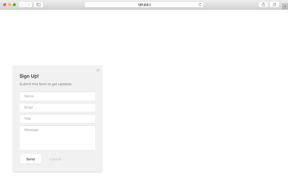
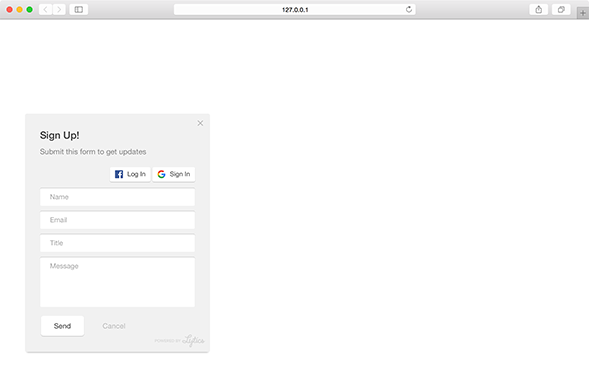

Used primarily for data collection or user identification. Supporting a variety of form fields and options for passing data to various end-points this type presents a form for the user to fill out and submit.

``` javascript
var module = pathfora.Form({
	// form module settings
});

pathfora.initializeWidgets([ module ]);
```


## layout

Define which layout type the form module should use.

| Value | Type | Behavior |
|---|---|---|
| modal | string | module uses a [modal layout](../layouts/modal.md) |
| slideout | string | module uses a [slideout layout](../layouts/slideout.md) |  

### Form - [Live Preview](../../examples/preview/types/form/modal.html)


<pre data-src="../../examples/src/types/form/modal.js"></pre>


### Slideout - [Live Preview](../../examples/preview/types/form/slideout.html)



<pre data-src="../../examples/src/types/form/slideout.js"></pre>


## showSocialLogin

With social login enabled, a module can show Google or Facebook login buttons which the user can use to connect to their account. This will autofill the form elements with their account information such as name and email.

| Value | Type | Behavior |
|---|---|---|
| false | boolean | `default` do not show social login buttons |
| true | boolean | show social login buttons |  

### Social Login /w Google & Facebook - [Live Preview](../../examples/preview/types/form/social.html)



<pre data-src="../../examples/src/types/form/social.js"></pre>